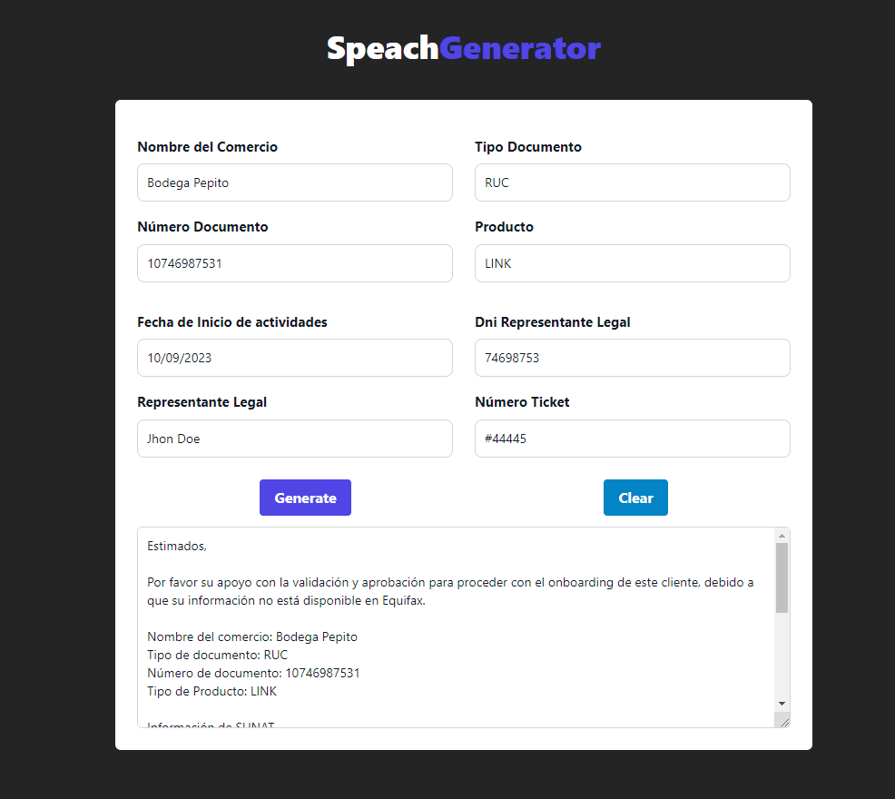

# SPEACH GENERATOR

Este proyecto es una aplicación web desarrollada con el fin de generar reportes o solicitudes a partir de información de clientes, todo dentro de un manejo interno y para mejora de procesos de equipo

## Tecnologías Utilizadas

- [Vite](https://vitejs.dev/): Un entorno de desarrollo rápido para aplicaciones web con JavaScript y TypeScript.

- [React](https://reactjs.org/): Una biblioteca de JavaScript para construir interfaces de usuario.

- [Tailwindcss](https://tailwindcss.com/): Un framework CSS para estilizar interfaces de usuarios.

## Capturas de Pantalla




## Instalación

A continuación, se detallan los pasos para instalar y utilizar la aplicación:

1. Clona el repositorio desde GitHub:

   ```shell
   git clone https://github.com/tu-usuario/generador-respuestas-tecnicas.git
   yarn
   npm install
   
2. Ejecutar:
    ```shell
   yarn dev
   npm run dev


